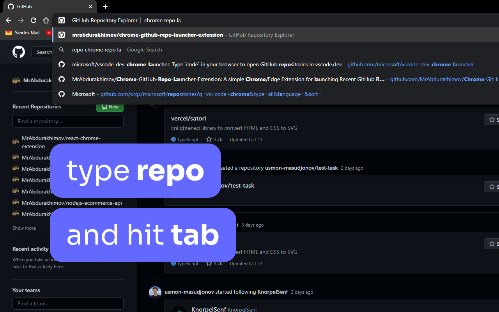

# GitHub Repository Explorer

A simple Chrome/Edge Extension for launching Recent GitHub Repositories, or searching on GitHub, inspired by VS Code Launcher by Microsoft (VS Code Team).

## Features

Type `repo` into your browser's search bar to activate the omnibox and launch your recent GitHub repositories

## YouTube Video

[GitHub Repo Explorer v1.0.0 - First look](https://youtu.be/IQCrWWshk3E)
